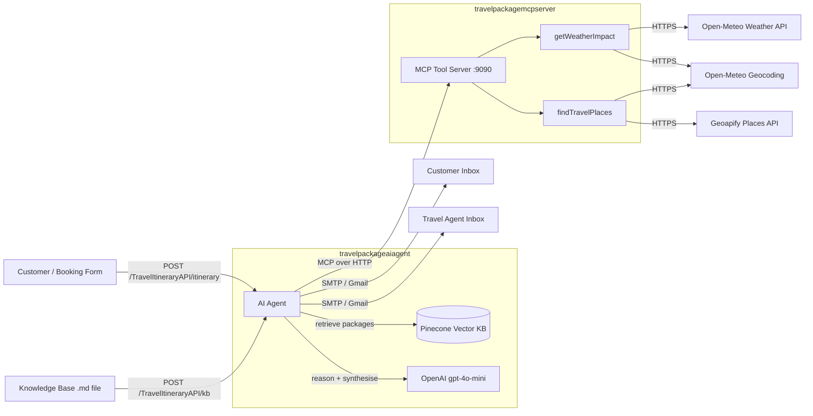

# AI Travel Package Assistant

An agentic AI integration built with **WSO2 Ballerina Integrator** that automates travel itinerary creation — from retrieving internal packages via RAG, to calling live weather and places APIs, to sending personalised HTML emails to both the customer and the travel agent.

---

## What It Does

A single API call triggers the full workflow:

1. The AI agent retrieves the best-fit travel package from a private knowledge base (RAG over Pinecone).
2. It calls live tools to get the weather forecast and discover nearby attractions for the customer's interests.
3. It applies the agency's business rules (budget bands, upsell logic, risk flags).
4. It sends a **customer-facing itinerary email** and an **agent-facing prospect summary email** via SMTP.

The agent never fabricates packages — every recommendation is grounded in the RAG-indexed knowledge base.

---

## Architecture



---

## Projects

| Project | Role | Key Files |
|---|---|---|
| `travelpackageaiagent` | AI agent, RAG ingestion, email delivery | `agents.bal`, `connections.bal`, `functions.bal`, `main.bal` |
| `travelpackagemcpserver` | MCP tool server exposing weather and places tools | `main.bal`, `functions.bal`, `connections.bal` |

### travelpackageaiagent

- **`main.bal`** — HTTP service with two endpoints: `POST /itinerary` and `POST /kb`.
- **`agents.bal`** — Declares the AI agent (`ballerina/ai`), the MCP toolkit, and the system prompt. The agent is capped at 100 iterations and uses `gpt-4o-mini`.
- **`connections.bal`** — Initialises all clients: Pinecone vector store, OpenAI embedding + model providers, MCP client, and Gmail SMTP client.
- **`functions.bal`** — `createTravelItinerary` orchestrates the RAG query, agent run, and email dispatch. `updateKB` writes an uploaded markdown file to disk and ingests it into Pinecone.
- **`types.bal`** — `TravelRequest` (request payload) and `agentResponseJson` (agent output shape).

### travelpackagemcpserver

- **`main.bal`** — MCP service listener on port `9090`, exposing two remote tools.
- **`functions.bal`** — `getWeatherImpact`: geocodes the destination, fetches a single-day forecast (max temperature + rain probability), and returns a human-readable summary and recommendation. `findTravelPlaces`: geocodes the destination, maps customer interests to Geoapify categories, and returns up to 10 nearby places.
- **`connections.bal`** — Three HTTP clients: Open-Meteo geocoding, Open-Meteo forecast, and Geoapify Places.
- **`types.bal`** — All external API response types and tool response types.

---

## Tech Stack

| Component | Technology |
|---|---|
| Integration runtime | WSO2 Ballerina Integrator (`ballerina/ai`, `ballerina/mcp`, `ballerina/http`, `ballerina/email`) |
| LLM | OpenAI `gpt-4o-mini` |
| Embeddings | OpenAI `text-embedding-3-small` |
| Vector store | Pinecone |
| Weather & geocoding | Open-Meteo (free, no key required) |
| Places | Geoapify Places API |
| Email | Gmail SMTP |

---

## Prerequisites

- **Ballerina 2201.13.2** or compatible
- API keys / credentials:
  - OpenAI API key
  - Pinecone API key (index URL: `https://travelpackage-3a9c20c.svc.aped-4627-b74a.pinecone.io`)
  - Gmail account with an app password (or any SMTP provider)

> Geoapify is currently hardcoded in `functions.bal`. Replace the key there if needed.

---

## Configuration

Each project has its own `Config.toml` (gitignored). Create them before running.

### `travelpackageaiagent/Config.toml`

```toml
[dileepagayan.travelpackageaiagent]
OPEN_AI_KEY    = "sk-..."
PINECONE_KEY   = "pcsk-..."
EMAIL_USERNAME = "your-sender@gmail.com"
EMAIL_PASSWORD = "your-app-password"
MCP_SERVER_URL = "http://localhost:9090"
```

### `travelpackagemcpserver/Config.toml`

No required configurables — the Geoapify key is currently hardcoded in `functions.bal`.

---

## Running Locally

Start the MCP server first, then the agent service.

### 1. Start the MCP tool server (port 9090)

```bash
cd travelpackagemcpserver
bal run
```

### 2. Start the AI agent service

```bash
cd travelpackageaiagent
bal run
```

The agent service starts on Ballerina's default HTTP listener (port `9090` by default — change `MCP_SERVER_URL` accordingly if there is a port conflict).

### 3. Load the knowledge base

Upload a markdown file containing your travel packages. This ingests it into Pinecone:

```bash
curl -X POST http://localhost:9090/TravelItineraryAPI/kb \
  -H "Content-Type: text/markdown" \
  --data-binary @travelpackageaiagent/files/ReceivedFile.md
```

### 4. Request an itinerary

```bash
curl -X POST http://localhost:9090/TravelItineraryAPI/itinerary \
  -H "Content-Type: application/json" \
  -d '{
    "destination": "Las Vegas",
    "travelDate": "2026-05-20",
    "budget": 2000,
    "interests": ["romantic", "shows", "good food"],
    "clientEmail": "jane@example.com",
    "agentEmail": "alex@travelco.com"
  }'
```

**Response**

```json
{
  "status": "success",
  "message": "Emails sent to jane@example.com and alex@travelco.com",
  "destination": "Las Vegas"
}
```

Both the customer and the travel agent receive HTML emails shortly after.

---

## API Reference

### `POST /TravelItineraryAPI/itinerary`

Generates a personalised itinerary and sends two emails.

| Field | Type | Description |
|---|---|---|
| `destination` | string | City name (e.g. `"Las Vegas"`) |
| `travelDate` | string | ISO date (e.g. `"2026-05-20"`) |
| `budget` | int | Budget in USD |
| `interests` | string[] | e.g. `["romantic", "shows", "good food"]` |
| `clientEmail` | string | Customer's email address |
| `agentEmail` | string | Travel agent's email address |

Supported interest values: `romantic`, `shows`, `food`, `good food`, `scenic`, `family`, `culture`.

### `POST /TravelItineraryAPI/kb`

Uploads a markdown knowledge base file and ingests it into Pinecone. Send the raw file as the request body.

---

## Credits

Built by Dileepa Dissanayake, showcasing the WSO2 Ballerina Integrator and Devant.
